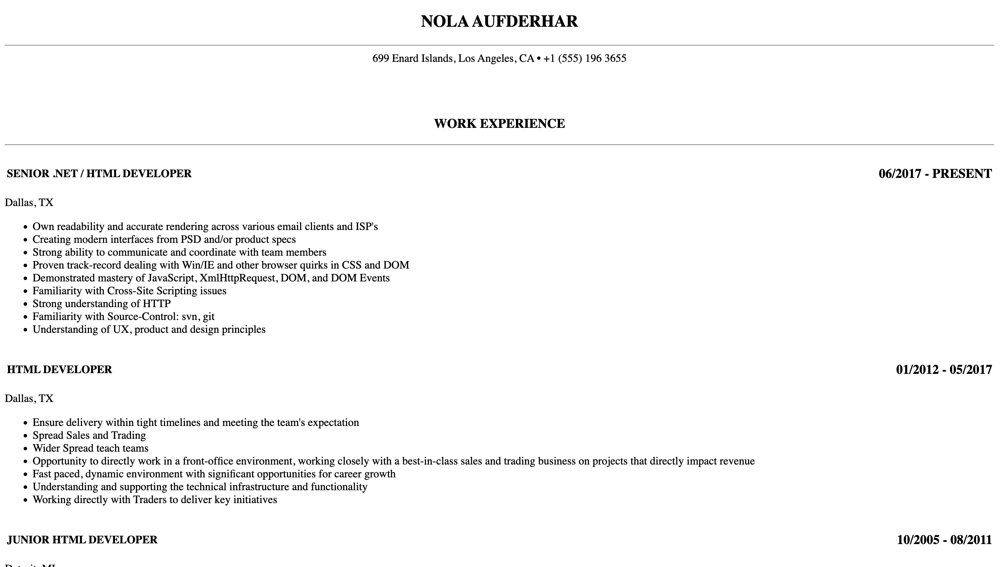
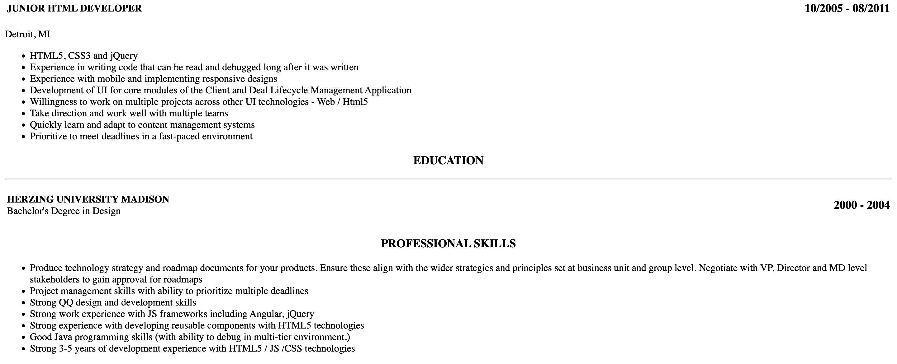

# Day 2 - HTML Resume Project

## Project Overview
This project involves creating a professional resume webpage using HTML. The goal is to recreate the resume format shown in the reference images using semantic HTML structure and proper formatting.

## Project Description
- **Objective**: Build a resume webpage that matches the provided design
- **Technologies Used**: HTML
- **Focus Areas**: 
  - Semantic HTML structure
  - Professional formatting
  - Clean layout design
  - Proper content organization

## Resume Sections Included
1. **Header**: Name and contact information
2. **Work Experience**: Multiple job positions with detailed responsibilities
3. **Education**: Academic background
4. **Professional Skills**: Technical and soft skills

## Key Features
- Professional layout matching traditional resume format
- Proper use of HTML semantic elements
- Well-organized content structure
- Clean and readable presentation

## Reference Images
The project is based on recreating the resume format shown in the attached screenshots:

### Screenshot 1 - Upper Section

*Shows the header, contact info, and work experience section*

### Screenshot 2 - Lower Section  

*Shows education and professional skills sections*

## File Structure
```
day2/
├── index2.html    # Main HTML resume file
└── README.md      # This documentation
```

## How to View
Open `index2.html` in any web browser to view the resume webpage.

## Learning Objectives
- Practice HTML semantic structure
- Understand resume formatting in web development
- Learn to organize content hierarchically
- Practice converting design mockups to HTML code